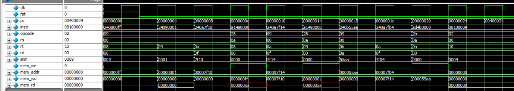
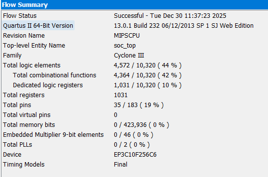
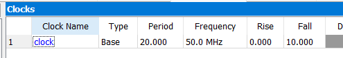
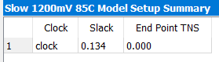

## 📌 Overview

This project implements a **simple SoC based on a MIPS CPU** with the following characteristics:

- Basic Integer Instructions  
- Unsigned operations only  
- Harvard architecture  
- Software development using **ASM + MARS**

### SoC Components
- MIPS CPU  
- ROM (Instruction Memory)  
- RAM (Data Memory)  
- Simple System Bus  
- GPIO  
- PWM  

---

## 1️⃣ Instruction Set Architecture (ISA)

The CPU supports a subset of basic MIPS integer instructions, organized into three instruction formats.

### 🔹 R-Type Instruction Format

  

### 🔹 I-Type Instruction Format

  

### 🔹 J-Type Instruction Format

  

---

## 2️⃣ Register File

The CPU contains a **general-purpose register file** used for arithmetic, logic, and data transfer operations.

  

---

## 3️⃣ CPU Architecture

The internal architecture of the MIPS CPU includes:
- Instruction Fetch  
- Decode  
- Execute  
- Memory Access  
- Write Back  

  

---

## 4️⃣ Control Unit

The Control Unit decodes instructions and generates control signals for:
- ALU  
- Register File  
- Memory  
- Program Counter  

  

---

## 5️⃣ System Bus

A simple system bus is used to connect:
- CPU  
- ROM  
- RAM  
- Peripherals (GPIO, PWM)  

  

---

## 6️⃣ Simple SoC Architecture

The complete SoC integration including CPU, memory, and peripherals is shown below.

  

---

## 7️⃣ Software Flow

Software is developed using:
- MIPS Assembly Language  
- MARS Simulator  

  

## 8️⃣ Results

### 🔹 CPU simulation

  

### 🔹 SoC simulation

  

## 9️⃣ Post-Implementation Analysis: Area, Power, and Timing

### 🔹 Area Report

  

### 🔹 Power Report

  

### 🔹 Timing Report

  

  

  

  

**Timing Analysis Remarks:**

The CPU is implemented using a **single-cycle architecture**, in which all instruction stages (fetch, decode, execute, memory access, and write-back) are completed within one clock cycle.  
As a result, the **critical path is relatively long**, limiting the maximum achievable clock frequency.

The timing analysis reports a **maximum operating frequency (Fmax) of 50.34 MHz**, which indicates that the design is **not frequency-optimized** compared to multi-cycle or pipelined architectures.

With the clock constraint set to **50 MHz**, both **setup slack and hold slack are positive**, confirming that:
- All setup timing requirements are satisfied  
- No hold time violations are detected  
- The design operates **correctly and reliably** under the specified timing constraint  

Overall, the timing results demonstrate that the single-cycle CPU meets the target clock frequency and functions correctly from a timing perspective.
